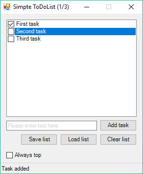

# Simple ToDoList

Простая программа для работы со списками задач (дел).

## Возможности

* Определение выполненных задач чекбоксом
* Чтение списка задач из внешнего текстового файла (UTF8)
* Сохраниние списка задач во внешний текстовый файл
* Автоматическое добавление задач при запуске из файла `simpletodolist.txt` лежащего в той же папке, что и программа
* Добавление "энтером"
* Счетчик задач в заголовке
* Опция "Поверх всех окон"

## Требования

* **Windows**
* **PowerShell** Version 2.0 и выше
* **.NET Framework** 2.0 и выше

## Внешний вид

## Установка

Программа не требует установки и состоит из одного файла `Simple ToDoList.exe`.

* x86: [Simple ToDoList.exe](raw/master/bin/x86/Simple%20ToDoList.exe)
* x64: [Simple ToDoList.exe](raw/master/bin/x64/Simple%20ToDoList.exe)